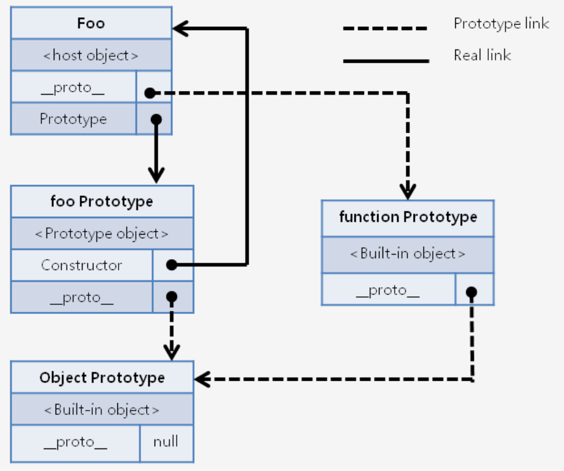
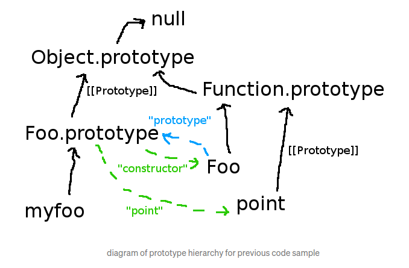

Javascript의 OOP & subclassing
===

### 프로토타입이란 무엇인가?

* 자바스크립트에서 객체 지향적인 개발개념을 가질 수 있게 해준다.
* 확장과 객체의 재사용을 가능하게 해준다.
* 자바스크립트에서는 prototype Object와 prototype Link를 통틀어 프로토타입이라고 하며, 이 둘의 차이를 인지해야 한다.

prototype Object : Prototype Property가 가리키고 있는 객체. 원본을 참조할 때 원본의 복사본이며 원본을 참조하는 다른 객체가 참조할 프로토타입이다.<br>
Prototype Link   : 자기 자신을 만들어낸 객체의 원형 ~ __proto\_\_ <br>

> 자바스크립트의 모든 객체는 자신을 생성한 객체 원형에 대한 숨겨진 연결을 갖는다. 이때 자기 자신을 생성하기 위해 사용된 객체원형을 프로토타입이란 한다. 자바스크립트의 모든 객체는 Object 객체의 프로토타입을 기반으로 확장 되었기때문에 이 연결의 끝은 Object 객체의 프로토타입 Object 다

#### prototype Property

* 모든 함수 객체의 Constructor는 prototype이라는 property(속성)을 가지고 있다. 이 prototype property는 객체가 생성될 때 해당 객체의 원형이 될 prototype객체를 가리킨다.

```js
var Human = function(name){
    this.name = name;
} 
//undefined

Human.prototype
/*
constructor: ƒ (name)
__proto__: Object  ///Human이라는 함수를 만들기 위해 사용된 객체 원형에 대한 연결
*/


var steve = new Human('Steve')
//undefined
steve
/*
Human {name: "Steve"}
name: "Steve"
__proto__: Object
*/
```

* Human의 prototype 속성은 자신을 원형으로 만들어질 새로운 객체들에게 물려줄 연결에 대한 속성이다.
* Human이라는 함수는 Human의 prototype 속성이 가지는 __proto\_\_ 안에 있는 속성들을 참조하여 만들어진다. 
* prototype 프로퍼티는 constructor 가 가지는 프로퍼티이며 steve의 경우 prototype property를 소유하고 있지 않다. // steve.prototype.name : syntax error



[출처](http://insanehong.kr/post/javascript-prototype/)

[출처](https://medium.com/@robertgrosse/how-es6-classes-really-work-and-how-to-build-your-own-fd6085eb326a)

```js
Object.prototype
/*{constructor: ƒ, __defineGetter__: ƒ, __defineSetter__: ƒ,
hasOwnProperty: ƒ, __lookupGetter__: ƒ, …}*/

toString.__proto__
//ƒ () { [native code] }
toString.__proto__.apply
//ƒ apply() { [native code] }
toString.__proto__.bind
//ƒ bind() { [native code] }

```

#### subclassing

```js
var A = function () { };
A.x=function() {
    console.log('hello');
};
A.prototype.x = function () {
     console.log('world');
};
var B = new A();
var C = new A();
B.x();
> world
C.x();
> world

```

* B,C는 A 를 프로토타입으로 사용하기위해서 A의 prototype Object를 사용한다.
* A의 프로토타입을 변경해주게 되면 B와 C는 변경된 A의 prototype Object를 상속받아 'world'를 출력한다. 


```js
var bar = function(name){
    this.name = name;
};
bar.prototype.learnFlying = function(){
    console.log(this);
    console.log(`${this.name} can fly!`);
}

let oldBee = new bar('oldBee')
var foo = function(){

};
//1번
foo.prototype = Object.create(bar.prototype)
//foo.prototype.constructor = foo : foo의 constructor는 bar를 바라보고있어서 재조정.
foo.prototype.sleep = function(){
    console.log('Zzz...')
};
var newBee = new foo('newBee');
//2번

newBee.sleep();
newBee.learnFlying();
newBee

```

##### 현재 newBee는 날지 못한다. 불쌍한 newBee를 날 수 있도록 해보자.

* foo.prototype = bar.prototype ;  사용 

1번위치에 넣게되면 bar의 프로토타입이 foo의 프로토타입으로 바뀌고 둘은 같은 객체를 참조하므로 1번 이후 bar의 프로토타입에 learn을 추가해주게되면 bar에 추가해주는 것과 동일해진다.<br>
2번 위치에 넣게 되면 bar의 프로토타입에 foo의 프로토타입으로 할당되고 아까 추가했던 learnFlying은 결국 사용하지 못하게 된다.//newBee.learnFlying is not a function


* foo.prototype = Object.create(bar.prototype); 사용

1과 마찬가지로 2번에 사용하게 되면 재할당이 이루어지기 때문에 문제가 발생하지만 1번에 사용하면 복사한 값을 넣어주기 때문에 bar의 prototype에는 영향이 가지 않는다.<br>//bar.prototype => {learnFlying: ƒ, constructor: ƒ}

#### newBee가 말할 수 있도록 해보자.


```js

//newBee.learnFlying()
//foo.prototype에 learnFlying 없음;
//__proto__로 올라감
//foo.prototype.__proto__ learnFlying있음
//learnFlying의 this는 무엇을 가리킬까? -> foo

//해결방법 1.
var foo = function(name){
this.name = name;
};

newBee.learnFlying();//'newBee can fly!'

//해결방법 2. 

var foo = function(name){
    bar.call(this,name);
};

```


### 전체 코드 class 로 modify

```js
class bar {
    constructor(name){
        this.name = name;
        console.log(this);
    };
    learnFlying(){
        console.log(`${this.name} can fly!`)
    }
};

let oldBee = new bar('oldBee')

class foo extends bar{
    constructor(name){
        super(name);
    }
    sleep(){
        console.log('Zzz...')
    }
}
let newBee = new foo('newBee');
newBee.sleep();
newBee.learnFlying();
/*
foo { name: 'newBee' }
Zzz...
newBee can fly!
*/
```

