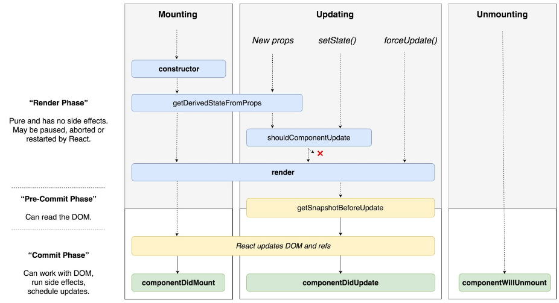

## diagram of modern React lifecycle methods.
[출처](https://twitter.com/dan_abramov/status/981712092611989509)

 
<br>[velop 설명](https://react.vlpt.us/basic/25-lifecycle.html)
#### Mount란 어떠한 것을 Available 한 상태로 준비하는 것
##### Mount과정

1. 컴포넌트가 만들어지면 가장 먼저 constructor메서드를 통해 component를 만듬-props 전달받음 
2. 이후 받아온 props를 state에 넣어주고 싶다면 getDerivedStateFromProps를 사용.
3. 이후 컴포넌트를 렌더링하고 DOM 업데이트

##### Update과정

1. 새로운 props를 받아와서 (getDerivedStateFromProps) setState를 통해 조건부(shouldComponentUpdate)로 업데이트 해줄 수 있다.
2. 이후 렌더링과정을 거치며  DOM이 업데이트 된다.

***

## ~ch9 code , (import,export 생략)

#### class component

```js

/// root.js
const rootElement = document.getElementById("root");
ReactDOM.render(
  <StrictMode>
    <App />
  </StrictMode>,
  rootElement
);


/// App.js
class App extends Component {
  render() {
    const value = 3;
    return (
      <div>
        {(() => {
          if (value === 1) return <div>하나</div>;
          if (value === 2) return <div>둘</div>;
          if (value === 3) return <div>셋</div>;
        })()}
        <MyName ash="ashaaaa" />
        <Counter />
      </div>
    );
  }
}


/// Counter.js

class Counter extends Component {
  state = {
    number: 1,
    num: 1
  };

  handleIncrease = () => {
    console.log(this); //Counter {props: Object, context: Object, refs: Object, updater: Object, state: Object…}
    console.log(this.state);
    this.setState({
      //컴포넌트 내장함수.. setState : 변화가 필요할때 사용
      number: this.state.number + 1
    });
    // 다른 표현법
    // this.setState(({ number }) => ({
    //   number: number + 1,
    //   bySet: "set"
    // }));
    console.log(this.state); //setState가 실행돼도 this.State는 그대로인 상태.
  };
  handleDecrease = () => {
    this.setState({
      number: this.state.number - 1
    });
  };

  render() {
    return (
      <div>
        <h1>카운터</h1>
        <div>값: {this.state.number}</div>
        <button onClick={this.handleIncrease}>+</button>
        <button onClick={this.handleDecrease}>-</button>
        <br />
        {this.state.num}
        {/* setState는 state 초기화가 아님 */}
      </div>
    );
  }
}

/// MyName.js
class MyName extends Component {
  static defaultProps = {
    //아무 값도 받지 않을 경우.
    name: "PPPPPPP",
    this: this,
    ash: "default"
  };
  render() {
    console.log(this.props); //{ash: "ashaaaa", name: "PPPPPPP", this: ƒ MyName()}
    //전달된 props와 디폴트 모두가짐. 중복의 경우 재할당.
    return (
      <div>
        Hello my name is {this.props.name}
        {this.props.ash}
      </div>
    );
  }
}
/*
 * 함수형 컴포넌트 :
 * 1. 초기마운트 속도 미세하게 빠름.
 * 2. 불필요한 기능x => 메모리 덜사용.
 
const MyName = ({ name, ash }) => {

  return (
    <div>
      안녕하세요! 제 이름은 {name} 입니다.
      <br />
      {ash}
    </div>
  );
};
MyName.defaultProps={
  name:'PPPPPPP'
}
*/

```

#### functional component

```js
/// root.js
const rootElement = document.getElementById("root");
ReactDOM.render(
  <StrictMode>
    <App />
  </StrictMode>,
  rootElement
);

/// App.js
export default function App() {
  return (
    <div>
      <Counter />
      <InputSample />
    </div>
  );
}

/// Counter.js
import React, { useState } from "react";

function Counter() {
  const [number, setNumber] = useState(0);
  const onIncrease = () => {
    console.log("+1");
    console.log(setNumber);
    setNumber((number) => {
      return number + 1;
    });
  };
  const onDecrease = () => {
    console.log("-1");
    setNumber(number - 1);
  };

  return (
    <div>
      <h1>{number}</h1>
      <button onClick={onIncrease}>+1</button>
      <button onClick={onDecrease}>-1</button>
    </div>
  );
}

/// inputSample.js
import React, { useState } from "react";

function InputSample() {
  const [inputs, setInputs] = useState({
    name: "",
    nickname: ""
  });
  const { name, nickname } = inputs;
  const onChange = (e) => {
    const { value, name } = e.target;
    setInputs({
      ...inputs,
      [name]: value
    });
  };
  const onReset = () => {
    setInputs({
      name:'',
      nickname:'',
    })
  };
  return (
    <div>
      <input name="name" placeholder="이름" onChange={onChange} value={name} />
      <input
        name="nickname"
        placeholder="닉네임"
        onChange={onChange}
        value={nickname}
      />
      <button onClick={onReset}>초기화</button>
      <div>
        <b>값: </b>
        {name} : {nickname}
      </div>
    </div>
  );
}


```